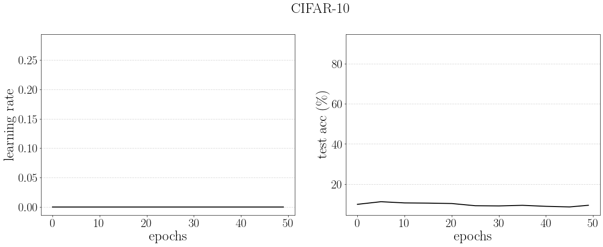

# Non-greedy Gradient Based HPO for Long Horizons

This is accompanying code for the paper "Non-greedy Gradient-based Hyperparameter Optimization Over Long Horizons" (on arxiv soon)

## What is this work about? (TLDR)

Our task is to learn hyperparameters with gradients such as learning rate, momentum and weight decay schedules. We use forward mode differentiation which allows us to optimize over the full horizon non-greedily for problems like CIFAR-10.

## Environment
Tested on:
- Python 3.6
- pytorch 1.2 (both cpu and gpu ok)
- tensorboard 1.10 (for logging, + needs tensorflow)

## Run HPO over CIFAR-10 (paper Figure 1)

Run `scripts/main0.sh`

## Notes

Not all configurations or seeds lead to the same schedules learned. This is to be expected since in practice it is easy to observe that two schedules can be very different and yet yield similar performances (especially when using BN). 

## Cite

coming soon

## TODO

If this repo becomes popular I will:

- Simplify hypergradient clipping. The current version takes into account the value of the hyperparameter at hand which helps when exploring configurations that aren't very stable. However I think it is an overkill in the vanilla configuration.
- Use average hypergradient rather than sum. For simplicity I have used hypergradient sums rather than averages since they are clipped anyways, but averages would make the outer optimizer for formally agnostic to horizon length.  
